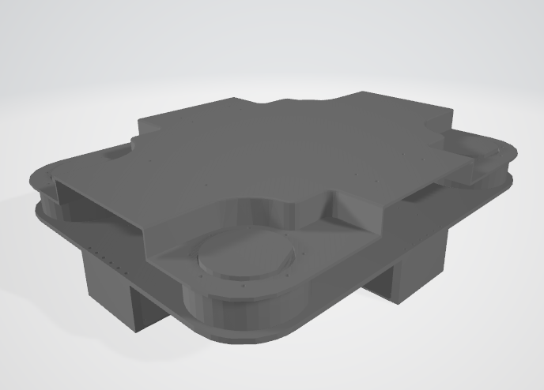
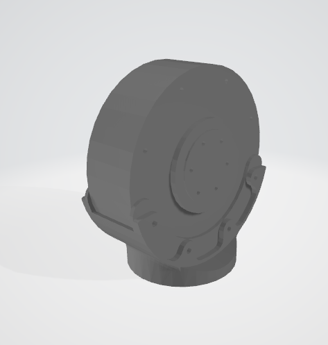
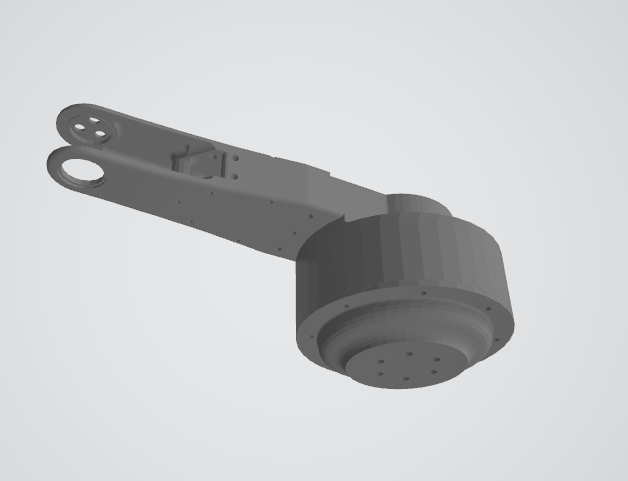
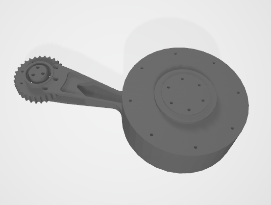
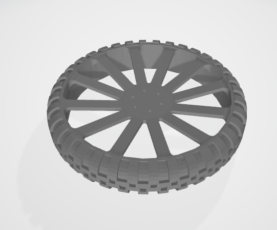

# legged_wheeled

## urdf

### `base_link`

底盘+四个yaw电机

### left_front

#### `left_front_abad`

- parent: `base_link`
- child: `left_front_abad`
- type: `revolute`
- limit
  - lower: -3.14
  - upper: 3.14
  - effort: 10
  - velocity: 275

#### `left_front_hip`

- parent: `left_front_abad`
- child: `left_front_hip`
- type: `revolute`
- limit
  - lower: -3.14
  - upper: 3.14
  - effort: 10
  - velocity: 275

#### `left_front_knee`

- parent: `left_front_hip`
- child: `left_front_knee`
- type: `revolute`
- limit
  - lower: -3.14
  - upper: 3.14
  - effort: 10
  - velocity: 275

#### `left_front_wheel`

- parent: `left_front_knee`
- child: `left_front_wheel`
- type: `revolute`
- limit
  - lower: -10000
  - upper: 10000
  - effort: 10
  - velocity: 400

All other three legs are the same

